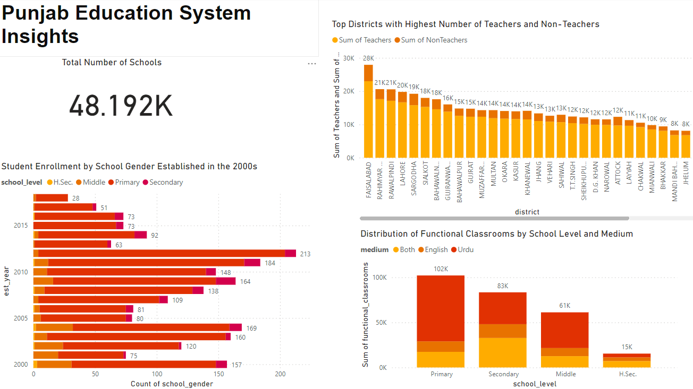

# Analyzing educational data to inform strategic initiatives for improving education in Punjab, Pakistan
## Analysis Report: Improving Education in Punjab, Pakistan

## Executive Summary

This analysis report aims to provide insights into the education landscape of Punjab, Pakistan, with a focus on identifying key challenges and proposing strategic initiatives for improvement. Leveraging data insights, the report addresses various aspects such as school enrollment, infrastructure, staffing, and facilities. Recommendations for the allocation of funds and targeted marketing strategies are presented to promote educational initiatives effectively.

## Table of Contents

1. Introduction
2. Dataset Analysis
3. Recommendations for Improvement
4. Budget Allocation Plan
5. Conclusion

## 1. Introduction

The education sector in Punjab, Pakistan, faces multifaceted challenges ranging from inadequate infrastructure to staffing issues. This analysis aims to utilize data-driven approaches to understand these challenges and propose actionable solutions to enhance the quality of education.

## 2. Dataset Analysis:

   
 
#### Total Number of Schools
- The dataset comprises 48,192 schools across Punjab.

#### Lowest Students by School Gender in the 2000s
- Higher secondary schools established in the 2000s have the lowest number of students.

#### Top 5 Districts with Highest Number of Teachers and Non-Teachers
- Faisalabad, Rahimyarkhan, Rawalpindi, Lahore, and Sargodha emerge as the top districts with the highest number of teachers and non-teachers.

#### School Level and Medium with Lowest Number of Functional Classrooms
Higher secondary schools present the lowest number of functional classrooms, totaling 15,396. Among these, 4,133 classrooms offer Urdu medium education, 4,144 offer English medium, and 7,149 offer both mediums.

#### Distribution of Teachers Across Different Schools
- GHS Sahiwal leads with 155 teachers, followed by GHS Fatehpur and GHS Model.

#### Gender Distribution of Students
- Female students: 25.23K
- Male students: 22.89K

#### Percentage of Schools Offering Urdu and English Medium Education
- Majority of schools in rural areas offer Urdu medium education (63.36%), followed by both mediums (15.79%), and English medium (8.86%).
- In urban areas, the percentage of schools offering Urdu medium education is 5.71%, followed by both mediums (3.76%), and English medium (2.52%).

#### District with Highest Enrollment in Primary Schools
- Rahimyar Khan records the highest enrollment in primary schools since their establishment, with 257,799 students.

#### District with Highest Enrollment in Secondary Schools 
- Faisalabad leads in enrollment in secondary schools, with 362,868 students.

#### District with Highest Enrollment in Higher Secondary Schools
- Higher secondary schools report 99,227 enrolled students.

#### Distribution of Schools According to School Level

- Primary: 31,994
- Middle: 8,277
- Secondary: 6,668
- Higher Secondary: 749

#### Bar Chart Representing Student Gender Distribution
#### Table Showcasing School Ownership
   
#### Distribution of Teachers Based on Job Posts: (Insert chart here)
   
#### Pie Chart Displaying Percentage of Vacant and Filled Teaching and Non-Teaching Posts: (Insert chart here)
   
 
#### Building Conditions and Security Measures:

#### Percentage of Schools with Satisfactory Building Conditions:
- 75.33%

#### Number of Schools with Satisfactory Security Measures: 
- 33823 Schools , 70.29%

### Basic Facilities Availability:

#### Districts with Lowest Availability of Drinking Water Facilities
1. Chiniot
2. Hafizabad
3. Nankana Sahib
4. Lodhran
5. Mandi Bahaudin
   
#### Districts with Lowest Availability of Electricity:
1. Chiniot
2. Hafizabad
3. Nankana Sahib
4. Lodhran
5. Mandi Bahaudin
   
#### Districts with Lowest Presence of Boundary Walls:
1. Lateef Abad
2. Chiniot
3. Hafizabad
4. Nankana Sahib
5. Lodhran

#### Districts with Lowest Availability of Toilets:
1. Lateef Abad
2. Abidabad
3. Hafizabad
4. Nankana Sahib
5. Chiniot

## 3. Recommendations for Improvement

### Infrastructure Enhancement
- Focus on upgrading infrastructure in higher secondary schools to address the shortage of functional classrooms.

### Targeted Staffing
- Allocate additional resources to districts with high teacher shortages to improve staffing levels.

### Gender-Responsive Education
- Implement initiatives to address the gender disparity in student enrollment.

### Medium of Instruction
- Provide support to schools offering education in English medium to enhance English language proficiency among students.

## 4. Budget Allocation Plan

Based on the identified needs, the following allocation of funds is proposed:
1. Infrastructure Improvement: $10 million
2. Staffing Enhancement: $5 million
3. Gender Equity Programs: $2 million
4. English Language Proficiency Initiatives: $1 million
5. Infrastructure Upgrade in Higher Secondary Schools: $2 million

## 5. Conclusion

In conclusion, the analysis highlights key areas for improvement in the education sector in Punjab, Pakistan. By implementing targeted interventions and allocating resources strategically, significant progress can be made towards enhancing educational outcomes and ensuring equal access to quality education for all.
